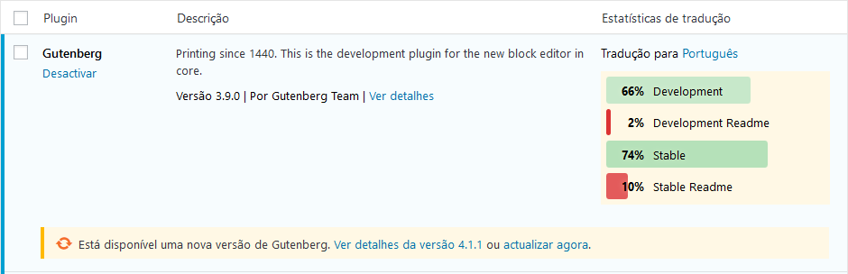
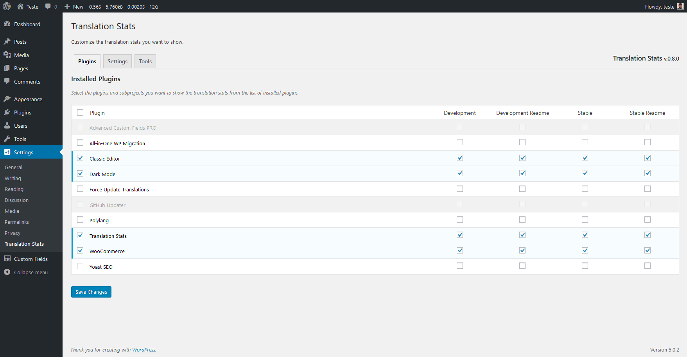

# Translation Stats #

**Contributors:** pedromendonca  
**Donate link:** [paypal.me/pedromendonca](https://paypal.me/pedromendonca/)  
**Tags:** internationalization, i18n, localization, l10n, translation, statistics, glotpress, dark mode  
**Requires at least:** 4.9  
**Tested up to:** 5.2.2  
**Requires PHP:** 5.6  
**Stable tag:** 0.9.4  
**License:** GPLv2 or later  
**License URI:** [http://www.gnu.org/licenses/gpl-2.0.html](http://www.gnu.org/licenses/gpl-2.0.html)  

Show plugins translation stats on your WordPress install.

## Description ##

The plugin adds a "Translation Stats" column to the plugin list screen in WordPress admin.

The translation stats are shown only for plugins that exist in [translate.wordpress.org](https://translate.wordpress.org/) and are [prepared for localization](https://developer.wordpress.org/plugins/internationalization/how-to-internationalize-your-plugin/).

If a plugin doesn't have complete translation stats, you'll see a notice with one of the reasons below:
*   Plugin not found on WordPress.org
*   Translation project not found on WordPress.org
*   The plugin is not properly prepared for localization

The color scheme of the translation stats bars is exactly same used in [GlotPress](https://wordpress.org/plugins/glotpress/) for consistency with the translation experience in [translate.wp.org](https://translate.wordpress.org/).

This plugin is properly prepared for localization.

## Frequently Asked Questions ##

### What are the plugin subprojects? ###

| Subproject             | Description                                                                                                |
| ---                    | ---                                                                                                        |
| **Development**        | Translation of the *Development* version of the plugin                                                     |
| **Development Readme** | Readme of the *Development* version of the plugin page on [wp.org/plugins](https://wordpress.org/plugins/) |
| **Stable**             | Translation of the *Stable* version of the plugin                                                          |
| **Stable Readme**      | Readme of the *Stable* version of the plugin page on [wp.org/plugins](https://wordpress.org/plugins/)      |

### How can I translate a plugin? ###
*   Register and login in [wp.org](https://login.wordpress.org/)
*   Click on the plugin subproject stats bar you want to translate
*   Read the Polyglots [Translator’s Handbook](https://make.wordpress.org/polyglots/handbook/)
*   Translate according the rules of your [Locale Translation Team](https://make.wordpress.org/polyglots/teams/)

### Should I translate both Stable and Development? ###
Since mid-April 2016, not only new strings but also edits are synced between dev and stable (both ways, only approved translations). When a plugin releases a new version all translations are copied from dev to stable. [Read more...](https://make.wordpress.org/polyglots/handbook/frequently-asked-questions/#should-i-translate-both-stable-and-dev)

### How long does it take for a translation to become available? ###
Translations for the readme are published almost immediately.
The language pack for a plugin will be generated when 95% of the Stable (latest release) sub-project strings have been translated.

### Is this plugin compatible with Dark Mode? ###
Yes, Translation Stats includes a color scheme that works specifically with the plugin [Dark Mode](https://wordpress.org/plugins/dark-mode/).

### Can I help translating this plugin to my own language? ###
Yes you can! If you want to translate this plugin to your language, please [click here](https://translate.wordpress.org/projects/wp-plugins/translation-stats).

### Can I contribute to this plugin? ###
Sure! You are welcome to report any issues or add feature suggestions on the [GitHub repository](https://github.com/pedro-mendonca/Translation-Stats).

## Screenshots ##

1.  Translation Stats shown in WordPress plugins page

2.  Translation Stats installed plugins list

3.  Translation Stats settings tab

4.  Translation Stats tools tab

## Changelog ##

### 0.9.4 ###
*   New AJAX loading and updating features
*   Improved plugins screen loading speed
*   New button to quick update a single plugin stats
*   Tested up to WP 5.2.2
*   Code optimization

### 0.9.3 ###
*   Tested up to WP 5.2.1
*   Code optimization

### 0.9.2 ###
*   Support for custom WordPress.org Locale Subdomains

### 0.9.1 ###
*   Support for current GlotPress 2.x variants
*   Fix typo

### 0.9.0 ###
*   Tested up to WP 5.1.1
*   Fix typo
*   Support new locales
*   Support for all locales in translate.wp.org through WordPress API

### 0.8.5 ###
*   Tested up to WP 5.1
*   Fix CSS issues
*   Fix WordPress Coding Standards errors

### 0.8.4 ###
*   Fix CSS issues

### 0.8.3 ###
*   Fix uninstall function

### 0.8.2 ###
*   Fix Author links

### 0.8.1 ###
*   Add Author column to plugins list - feature suggestion from [Webdados](https://www.webdados.pt/)
*   Add links to plugins and authors
*   Fix WordPress Coding Standards errors

### 0.8 ###
*   Add Translation Stats settings page
*   Add installed plugins table to select only the plugins you want to manage translation stats to reduce http requests
*   Add option to enable or disable warnings of translation projects
*   Add options to reset settings and clean cache to force update the translation stats
*   Add option to specify the translation language you want
*   Add option to choose to keep or delete plugin data on uninstall
*   Add uninstall file

### 0.7 ###
*   Fix Translation Stats column show/hide logic
*   Use [WordPress Coding Standards](https://github.com/WordPress-Coding-Standards/WordPress-Coding-Standards)

### 0.6 ###
*   Add WordPress core notices styles to error messages
*   Add assets
*   Minor code improvements
*   Readme update

### 0.5 ###
*   Initial release.
