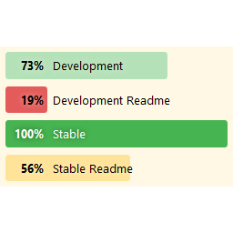

# Translation Stats #
**Contributors:** pedromendonca  
**Donate link:** http://paypal.me/pedromendonca/  
**Tags:** glotpress, translation, statistics, i18n, l10n, dark mode  
**Requires at least:** 4.9  
**Tested up to:** 4.9  
**Stable tag:** 0.6.0  
**License:** GPLv2 or later  
**License URI:** http://www.gnu.org/licenses/gpl-2.0.html  

WordPress plugin to show plugins translation statistics from WordPress.org on the dashboard.

## Description ##

The plugins adds a "Translation Stats" column to the plugin list screen in WordPress admin. The translation data is fetched from translate.wordpress.org, if the plugin exists in the directory and if it's prepared for localization.
